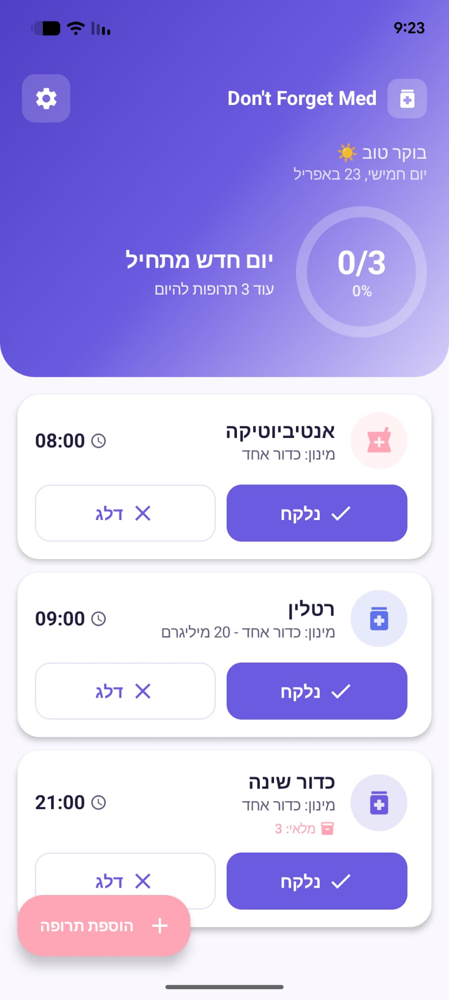
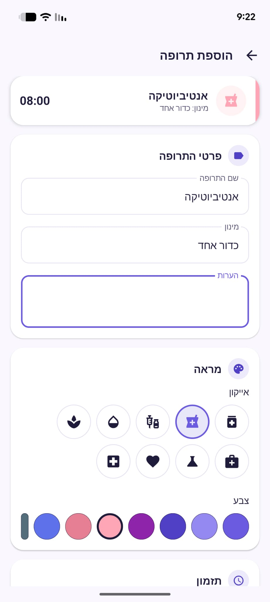

<div align="center">

# 💊 Don't Forget Med

### לא לשכוח אף פעם לקחת תרופה.

אפליקציית אנדרואיד עדינה, נקייה ובעברית — שמזכירה לכם את התרופות בזמן, עוקבת אחרי המלאי, ודואגת שלא יחסר לכם כלום.

[](https://github.com/MaozEpsein/dontforgetmed-/releases/latest)
[](https://www.android.com/)
[](https://kotlinlang.org/)
[](https://developer.android.com/jetpack/compose)

</div>

---

## 📱 צילומי מסך

<div align="center">

<table>
<tr>
<td align="center" width="50%">
<br/>
<sub><b>מסך הבית — תרופות היום במבט אחד</b></sub>
</td>
<td align="center" width="50%">
<br/>
<sub><b>הוספת תרופה — אייקון וצבע לכל אחת</b></sub>
</td>
</tr>
</table>

</div>

---

## ✨ מה האפליקציה עושה

- ⏰ **התראות אמינות** — גם כשהמסך כבוי, גם בלי אינטרנט (AlarmManager)
- 💊 **ניהול תרופות אישי** — שם, מינון, הערות, אייקון וצבע מותאמים
- 📅 **מסך בית יומי** — כל התרופות של היום, מסודרות לפי שעה, עם פרוגרס עיגול
- ✅ **נלקח / דלג / דחיה** — כל התראה עם כפתורי פעולה מהירים (15/30/60 דק' או שעה מותאמת)
- 📦 **ניהול מלאי** — התראה אוטומטית לפני שתרופה נגמרת
- 🏠 **ווידג'ט למסך הבית** — לחיצה אחת מסמנת "נלקח" בלי לפתוח את האפליקציה
- 🔁 **תזמון גמיש** — יומי, שבועי, ימים ספציפיים בשבוע
- 🔒 **הכל נשאר אצלך** — 100% מקומי, ללא שרתים, ללא חשבון, ללא מעקב
- 🇮🇱 **עברית מלאה + RTL** — תוכנן מהיסוד לחוויה ישראלית

---

## 🎨 עיצוב

האפליקציה בפלטה **Lavender Calm** — גוונים רגועים של סגול/לבנדר שנבחרו בכוונה כדי *לא* לייצר תחושת דחיפות אדומה סביב משהו שאמור להיות חלק מהשגרה. טיפוגרפיה גדולה, מרווחים נדיבים, כפתורים נוחים — גם למשתמשים מבוגרים יותר.

- **Material 3** עם Jetpack Compose
- **Light / Dark** אוטומטי לפי העדפות המכשיר
- **אנימציות עדינות** (motion לא מוגזם) לכל מעבר
- **אייקונים + צבעים לבחירה** לכל תרופה — זיהוי מיידי במבט

---

## ⬇️ הורדה והתקנה

1. הורד את ה-APK האחרון מ-[דף השחרור](https://github.com/MaozEpsein/dontforgetmed-/releases/latest)
2. פתח את הקובץ בטלפון — אם אנדרואיד חוסם, אפשר "התקנה ממקורות לא ידועים" ← אפליקציה זו
3. בפתיחה הראשונה — אשר הרשאות **התראות** ו-**התראות מדויקות** (Exact Alarms)

> דרישות: Android 8.0 (API 26) ומעלה

---

## 🛠️ מתחת למכסה

| תחום | טכנולוגיה |
| --- | --- |
| שפה | Kotlin 2.0 |
| UI | Jetpack Compose + Material 3 |
| ארכיטקטורה | MVVM |
| Persistence | Room |
| תזמון | AlarmManager + WorkManager |
| בנייה | Gradle 9, AGP 8.5 |
| CI/CD | GitHub Actions — APK אוטומטי בכל `v*` tag |

```
app/
├── data/           # Room entities, DAO, repository
├── ui/             # Compose screens, theme, components
├── notifications/  # AlarmManager scheduling & receivers
├── widget/         # Home-screen glance widget
└── util/           # Helpers, prefs, extensions
```

---

## 👨‍💻 להרצה מקומית

```bash
git clone https://github.com/MaozEpsein/dontforgetmed-.git
cd dontforgetmed-
./gradlew assembleDebug
```

פתח ב-Android Studio, Sync, ו-Run.

---

## 📄 רישיון

MIT — מוזמנים להשתמש, לשנות, לשתף.

<div align="center">

<br/>

נבנה באהבה, באמצעות Kotlin ו-Jetpack Compose 💜

</div>
